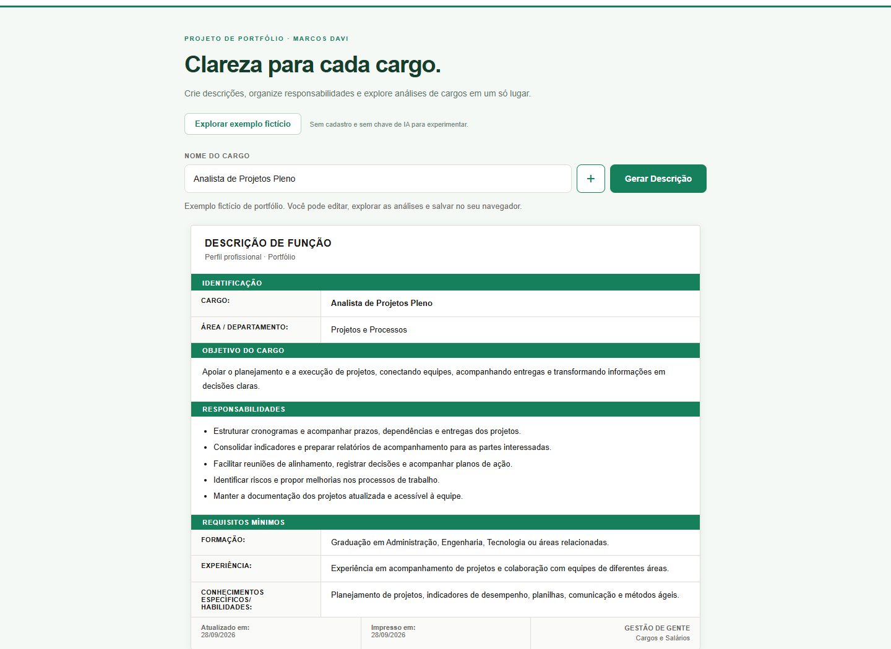

# Descrição de Cargos — Marcos Davi

Apresentação do projeto com imagens, grading orientativo e pesquisa salarial.

[**Acessar o portfólio**](https://xmarcosdavi.github.io/descricao-de-cargos/) · [Demo interativa](https://xmarcosdavi.github.io/descricao-de-cargos/demo.html)

## Recursos

- Criação e revisão de descrições com apoio de IA.
- Biblioteca local e exportação de documentos.
- Análise de complexidade e grading orientativo.
- Pesquisa salarial com visão nacional e comparação por UF.

A galeria usa exemplos fictícios. Grading e referências salariais são orientativos, sem classificação oficial ou conversão automática de grade em salário.

## Demonstração

Abra a demo e clique em **Explorar exemplo fictício**. Geração por IA exige a chave Groq do visitante, mantida apenas na sessão. Descrições salvas ficam no navegador.

## Arquivos

Esta é a versão de publicação: a apresentação usa index.html, styles.css, vitrine.js e as imagens. demo.html reúne a aplicação demonstrativa em arquivo único.

Desenvolvido por **Marcos Davi** com HTML, CSS e JavaScript.

[LinkedIn](https://www.linkedin.com/in/marcosdavi-adm/)
